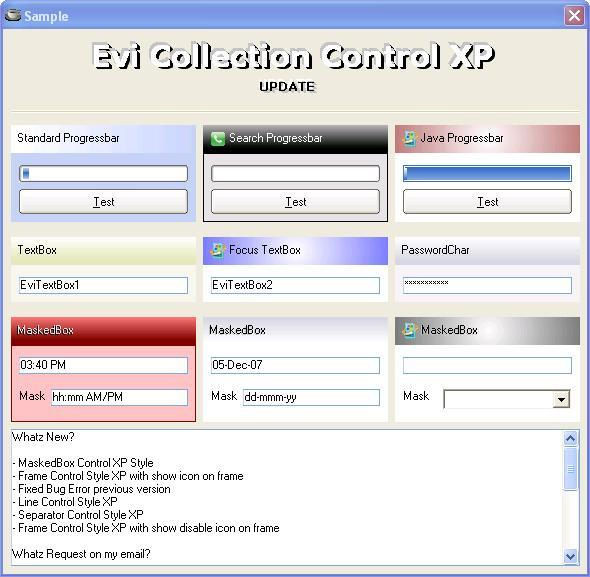



## Evi Collection Control XP UPDATE v1\.1

### Description

Whatz New?

- MaskedBox Control XP Style

- Frame Control Style XP with show icon on frame

- Fixed Bug Error previous version

- Line Control Style XP

- Separator Control Style XP

- Frame Control Style XP with show disable icon on frame

Whatz Request on my email?

- MaskedBox Control Style XP

- Line Control Style XP

- Separator Control Style XP

Whatz Bug found on previous version?

- Text will be loss if press enter

- Text will be loss if change scrollbar manualy

If you found bug or have request control, you can email me on effendi24@gmail.com or contact my phone 628112422491. Dont forget to vote me.

please visit to my site http://vb6stuff.blogspot.com/

---

----

Having Fun My Friend 

----

---
 
### More Info
 

             |
---                |---
**Submitted On**   |2007-12-05 15:42:54
**By**             |[Evi Indra Effendi](https://github.com/Planet-Source-Code/PSCIndex/blob/master/ByAuthor/evi-indra-effendi.md)
**Level**          |Intermediate
**User Rating**    |4.6 (74 globes from 16 users)
**Compatibility**  |VB 5\.0, VB 6\.0
**Category**       |[Custom Controls/ Forms/  Menus](https://github.com/Planet-Source-Code/PSCIndex/blob/master/ByCategory/custom-controls-forms-menus__1-4.md)
**World**          |[Visual Basic](https://github.com/Planet-Source-Code/PSCIndex/blob/master/ByWorld/visual-basic.md)
**Archive File**   |[Evi\_Collec2092881252007\.zip](https://github.com/Planet-Source-Code/evi-indra-effendi-evi-collection-control-xp-update-v1-1__1-69723/archive/master.zip)

